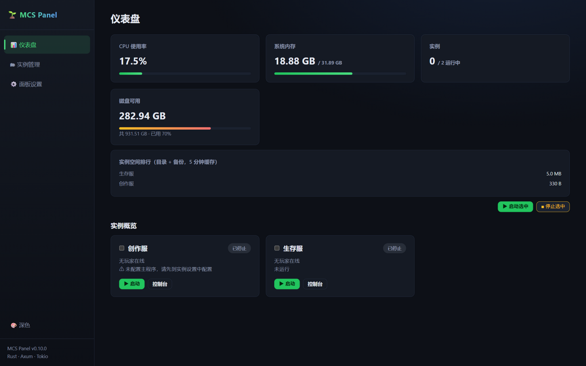
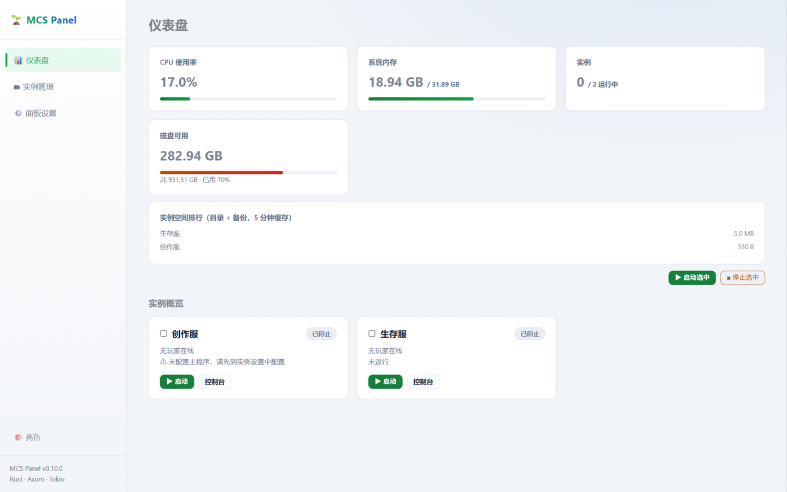
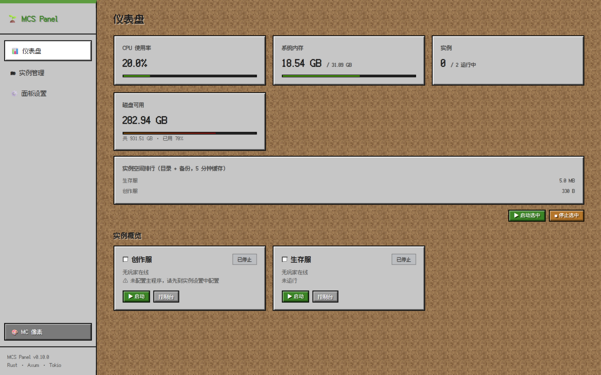
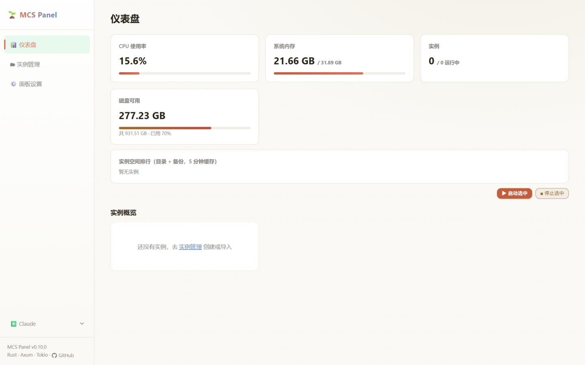
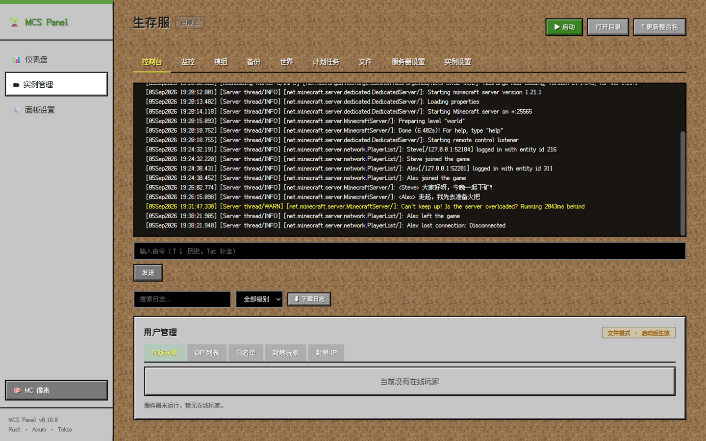
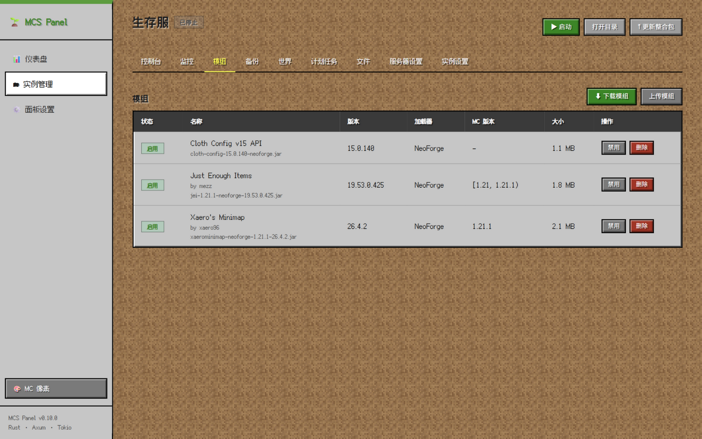
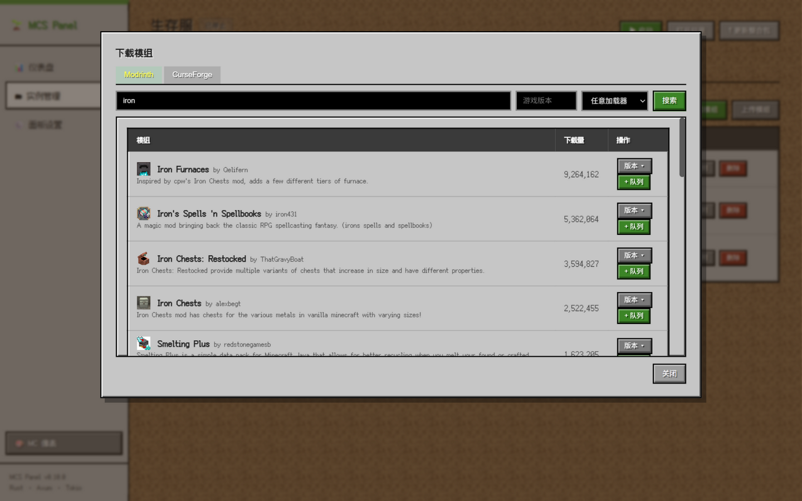
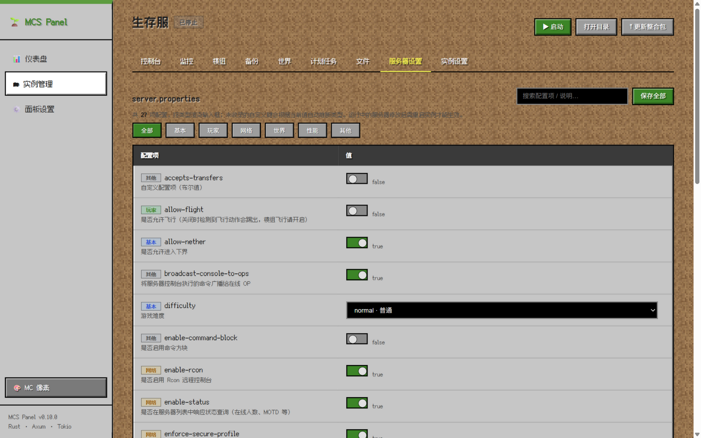
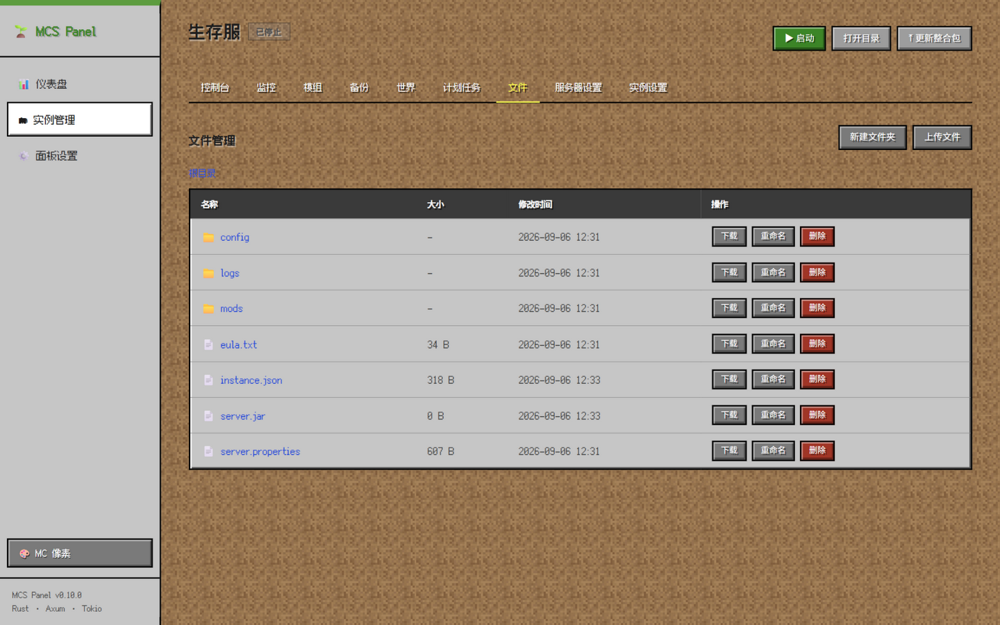

# MCS Panel — Minecraft 服务端管理面板

   

基于 Rust（Axum + Tokio）的本地 Minecraft 服务器管理面板。前端资源内嵌进二进制，构建产物为**单个可执行文件**，开箱即用，支持 Windows 与 Linux。

## ✨ 功能特性

**实例管理**
- 新建实例三种方式：自动下载官方原版服务端（版本清单、镜像回退、SHA1 校验、下载进度）；创建模组服（Fabric / Quilt / Forge / NeoForge / Paper / Purpur / Folia / Velocity / Waterfall / BungeeCord）；导入整合包
- 启动 / 停止 / 重启 / 删除 / 克隆 / 重装；异常退出自动重启，重启风暴熔断
- **整合包更新**：上传新版本 zip → 预览差异（新增 / 覆盖 / 包外模组）→ 可选自动备份 → 自动同步模组与配置；CurseForge / Modrinth / 通用服务端包均支持；MC 版本或加载器变化时自动重装加载器
- 世界存档管理：查看、切换、新建、删除

**监控与可观测性**
- 仪表盘：系统 CPU / 内存、磁盘用量、各实例进程 CPU / 内存占用、实例空间排行
- 实例监控：TPS / MSPT（RCON 采集）与 CPU / 内存历史图表
- 操作审计：写操作与失败请求自动记录，敏感参数脱敏，支持查询
- 告警推送：实例崩溃、计划任务连续失败、磁盘水位——支持 Webhook / Discord / Telegram

**面板账户与实例授权**
- 用户名 / 密码登录，管理员拥有完整管理权限，可创建账户、重置密码、禁用账户与分配实例查看权限
- 普通用户的「我的实例」列表仅显示被授权实例；详情提供「公告」与「运行信息」两个只读标签页
- 实例公告支持 Markdown 编辑、预览与安全渲染；运行信息显示 TPS、运行状态、玩家累计及当前会话在线时长

**模组与配置**
- 模组在线下载：Modrinth 与 CurseForge 搜索，按游戏版本 / 加载器过滤，队列式批量安装，自动解析前置依赖，SHA1 校验
- 换版本即替换：已安装模组下载新版本后自动清理旧文件；删除模组时自动检查多层依赖并可级联删除
- 模组元数据解析（名称、版本、加载器、MC 版本），启用 / 禁用 / 上传 / 删除
- 文件浏览器：浏览 / 编辑 / 上传 / 下载 / 重命名 / 删除 / 在线解压（zip / tar.gz）
- 图形化编辑 `server.properties`（保留注释与顺序，按类型渲染输入框并附中文说明）

**运维**
- 实时 WebSocket 控制台：着色日志、命令历史、Tab 补全、日志搜索过滤与下载；GBK 自动转码
- 用户管理：在线玩家快捷操作，OP / 白名单 / 封禁玩家 / 封禁 IP（运行中实时生效，停止时读写对应 JSON 文件，UUID 自动解析）
- 计划任务：定时执行命令 / 备份 / 重启，连续失败自动告警
- 备份：全量 tar.gz，恢复前预览差异，按份数与天数自动清理
- 游戏内备份：识别 ServerUtilities 模组与配置，在独立标签页触发模组备份、列出和下载 ZIP、预览及停止后恢复；恢复前保留受影响数据副本
- Java 环境：扫描本机全部 Java（各发行版 / 启动器自带 / IDE 下载），一键安装 Temurin JRE 8 / 11 / 17 / 21 / 25
- 四套主题：深色 / 亮色 / MC 像素（内置中文像素字体）/ Claude（暖纸色），侧边栏底部下拉切换

### 游戏内备份

打开实例详情的「游戏内备份」标签页，可查看 ServerUtilities 的版本、自动备份间隔、保留数量和历史 ZIP。实例完成启动后点击「立即备份」，面板发送 `backup start`，等待模组完成并校验归档。返回标签页时可继续查看最近任务的日志；「刷新」可更新模组自动生成的备份。

恢复前先停止实例，预览世界及额外文件范围，并确认所选备份。面板完整校验 ZIP，暂存解压结果，再保存当前受影响数据并安装备份；恢复前副本位于实例的 `.mcspr-recovery/<时间-唯一标识>/`，任务日志显示具体位置。恢复完成后手动启动实例。生产世界恢复会回退玩家进度，请明确恢复点并保留当前副本。

当前支持 ServerUtilities；其备份目录须位于实例内。拒绝路径穿越、符号链接、保护路径、重复冲突条目及超过 32 GB 或 200,000 条目的归档。列表中损坏的 ZIP 会显示异常提示，预览和恢复执行完整 CRC 校验。
## 🚀 快速开始

**方式一：下载预编译版本**

从 [GitHub Releases](../../releases) 下载对应平台压缩包，解压后运行。

**方式二：从源码构建**

```bash
git clone https://github.com/liansishen/mcspr.git
cd mcspr
cargo build --release
```

构建产物为 `target/release/mcspr`（Linux）或 `target/release/mcspr.exe`（Windows）。运行后浏览器打开 `http://127.0.0.1:8080`。

> 环境要求：运行需要 Java（与服务器版本匹配）；仅构建需要 Rust 1.75+，Linux 构建无需任何系统 TLS 依赖。

## ⚙️ 配置

首次运行自动生成 `config.toml`：

| 配置项 | 默认值 | 说明 |
| --- | --- | --- |
| `listen` | `"127.0.0.1:8080"` | 监听地址；`0.0.0.0:8080` 对局域网开放，公网部署建议配合 HTTPS |
| `data_dir` | `"data"` | 实例数据目录 |
| `token` | 空 | 旧版本配置兼容字段；账户认证启用后使用用户名 / 密码与会话 Cookie |
| `curseforge_api_key` | 空 | CurseForge 模组搜索下载用；留空仅支持 Modrinth |
| `backup_keep` / `backup_keep_days` | `10` / `30` | 备份保留份数与天数 |
| `alert_type` | `"none"` | 告警推送：`none` / `webhook` / `discord` / `telegram` |
| `alert_webhook_url` / `telegram_bot_token` / `telegram_chat_id` | 空 | 告警推送目标 |
| `[thresholds]` | 见下 | `crash_window_secs=600`、`crash_max=3`、`restart_delay_secs=5`、`disk_warn_percent=90` |

机密字段（API Key / Bot Token）在「面板设置」页保存后不回显，留空保存即保持不变。

### 账户认证初始化与升级

升级到此功能分支时，在面板工作目录使用本地交互命令创建首个管理员：

```bash
./mcspr --init-admin
```

按提示输入用户名和密码，再启动面板并在浏览器登录。账户和授权保存在数据目录的 `auth/users.json`；请将该文件纳入安全备份。业务接口在管理员初始化后通过登录会话访问，旧版访问令牌退出认证流程。

忘记管理员密码时，在面板工作目录执行本地恢复命令：

```bash
./mcspr --reset-admin-password
```

恢复密码前须停止面板服务，再在其工作目录执行命令；服务运行时账户存储被锁定，恢复命令会拒绝执行。恢复完成后重新启动并登录。正常账户管理中的密码重置、禁用及角色变更会撤销已有会话；面板重启后所有用户重新登录。管理员撤销实例授权后，普通用户的下一次读取请求失去访问权限。

密码使用 Argon2id 哈希保存。浏览器通过 HttpOnly 会话 Cookie 登录，写请求带有防跨站请求伪造的令牌。公网访问建议使用 HTTPS，局域网或本机访问按实际协议配置。

### 玩家在线时长

累计值包含已结算时长和正在进行的当前会话。玩家表按实例显示全体已记录玩家的在线状态、累计时长和本次在线时长。

统计从面板采集到的加入日志开始；历史数据沿用实例中的 `player-stats.json`。缺少标准加入 / 离开日志的服务端可能存在统计缺口，强制结束面板可能丢失未结算时长。正常停服会结算并保存。

本次浏览器验收由用户实施，步骤见 [账户与实例授权浏览器验收清单](docs/account-browser-checklist.md)。

## 🐧 Linux 部署

Release 提供 Linux x64 / ARM64 的 musl **静态链接**二进制，任何发行版解压即用：

```bash
tar xzf mcspr-linux-x64.tar.gz && chmod +x mcspr
./mcspr
```

建议用 systemd 托管（`/etc/systemd/system/mcspr.service`）：

```ini
[Unit]
Description=MCS Panel
After=network.target

[Service]
WorkingDirectory=/opt/mcspr
ExecStart=/opt/mcspr/mcspr
Restart=on-failure

[Install]
WantedBy=multi-user.target
```

面板自身的自动启动 / 重启与服务器进程管理均已在 Linux 下适配；强制结束时使用 `kill -9`。

## 🔁 自动构建

仓库内置 GitHub Actions 工作流：推送 `v*` 标签自动构建三平台产物并发布 Release——`mcspr-windows-x64.zip`、`mcspr-linux-x64.tar.gz`、`mcspr-linux-arm64.tar.gz`。

## 🖼 界面预览

**三套主题（仪表盘）**

| 深色 | 亮色 | MC 像素 | Claude |
| --- | --- | --- | --- |
|  |  |  |  |

**MC 像素主题**

| 实时控制台 | 模组管理 |
| --- | --- |
|  |  |
| 模组在线下载 | 服务器设置 |
|  |  |
| 文件管理 | |
|  | |

## 📖 API 概览

所有接口位于 `/api` 前缀下；业务接口使用登录后设置的会话 Cookie。写请求同时携带 `X-CSRF-Token`。

| 分组 | 端点 |
| --- | --- |
| 登录与账户 | `POST /api/auth/login` · `POST /api/auth/logout` · `GET /api/auth/me` · `PUT /api/auth/password` · 管理员：`GET/POST /api/accounts`、`PATCH/DELETE /api/accounts/{id}`、`PUT /api/accounts/{id}/password`、`PUT /api/accounts/{id}/instances` |
| 实例只读与公告 | `GET /api/instances/{id}/overview` · `GET /api/instances/{id}/playtime` · `GET/PUT /api/instances/{id}/announcement` · 管理员：`POST /api/announcements/preview` |
| 全局 | `GET /api/stats` · `GET /api/versions` · `GET /api/settings` · `PUT /api/settings` · `GET /api/audit` · `GET /api/config/export` · `POST /api/config/import` |
| 实例 | `GET/POST /api/instances` · `GET/PATCH/DELETE /api/instances/{id}` · `GET /api/instances/{id}/status` |
| 进程 | `POST .../start` `.../stop` `.../restart` `.../command` `.../eula` `.../open` · `GET .../console` · `WS .../ws` |
| 模组 | `GET .../mods` · `POST .../mods/toggle` `.../delete` `.../upload` · `GET .../mods/hashes` |
| 模组市场 | `GET /api/moddb/search` `.../versions` `.../projects` · `POST /api/moddb/version-files` |
| 文件 | `GET .../files` · `GET/PUT .../files/content` · `POST .../files/mkdir` `.../delete` `.../rename` `.../upload` `.../extract` `.../archive` · `GET .../files/download` `.../archive-download` |
| 备份与世界 | `GET/POST /api/instances/{id}/backups` · `GET .../backups/{name}/preview` · `POST .../backups/{name}/restore` · `GET .../backups/{name}/download` · `DELETE .../backups/{name}` · `GET/POST .../worlds` `.../worlds/switch` `.../worlds/create` `.../worlds/delete` |
| 游戏内备份 | `GET/POST /api/instances/{id}/game-backups` · `GET .../game-backups/{name}` · `GET .../game-backups/{name}/preview` · `POST .../game-backups/{name}/restore` |
| 计划任务 | `GET/POST .../tasks` · `POST .../tasks/update` |
| Java | `GET /api/javas` · `POST /api/javas/scan` · `GET /api/java-install/list` · `POST /api/java-install/{major}` |
| 其他 | `GET/POST .../users` `.../users/action` · `GET/PUT .../properties` · `POST .../clone` `.../reinstall` · `GET .../icon` · `POST /api/instances/import/upload` `.../import/path` · `POST /api/instances/{id}/modpack/preview` `.../modpack/apply` · `GET /api/jobs/{id}` |

## ❓ 已知限制

- Forge / NeoForge 1.17+ 服务包以 `@argfile` 方式启动，导入器会自动从 `run.bat` 提取参数；若包内未安装 libraries，需先运行一次官方安装器
- 面板进程重启时，正在运行的服务器进程会成为孤儿进程（不会退出），建议先停止实例再重启面板
- `server.properties` 修改在服务器运行期间不会热生效，需重启实例
- 超过 2MB 或二进制格式的文件不允许在线编辑（可上传替换）
- 所有路径操作都限制在实例目录内，拒绝 `..` 与绝对路径；普通用户只能读取已授权实例的公告和运行信息

## 许可证

本项目以 [MIT License](LICENSE) 开源；内置 MC 主题像素字体为 [Fusion Pixel Font](https://github.com/TakWolf/fusion-pixel-font)（OFL 许可）。
